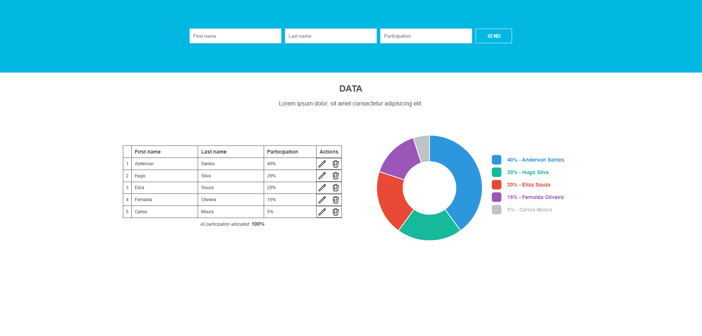
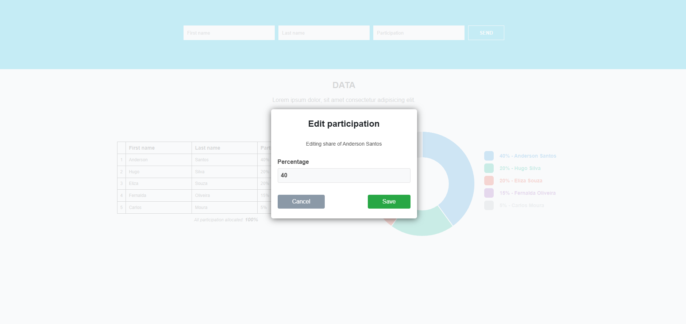

# Desafio Fullstack Cotabox

 **Deploy da Aplicação**  
Este projeto está hospedado e pode ser acessado diretamente pelos links abaixo.

- **Frontend**: [https://teste-cotabox.vercel.app/](https://teste-cotabox.vercel.app/)  
- **Backend (API)**: A API está hospedada na Railway e é acessada pelo frontend para todas as operações.

---

 **Descrição do Projeto**  
Este projeto foi desenvolvido como parte do processo seletivo da Cotabox para a vaga de Estágio em Desenvolvimento Fullstack. A solução consiste em uma aplicação completa com frontend em Vue.js e uma API RESTful em Node.js para gerenciar dados de participantes e exibir informações de forma visual.

O objetivo foi criar uma interface amigável para inserir dados e um backend robusto para processá-los, seguindo as boas práticas e requisitos do desafio.

---

 **Screenshots da Aplicação**  
Aqui estão algumas capturas de tela para uma visão geral da interface e das funcionalidades do projeto:

- **Página Principal e Tabela de Dados**  

 

- **Modal de Edição de Participação**

---

 **Requisitos Atendidos**  
Todas as especificações do desafio foram cuidadosamente implementadas:

- **Front-end**: A interface foi desenvolvida seguindo o layout fornecido, com formulário de inserção de dados, tabela de participantes e um gráfico de pizza que representa a distribuição das porcentagens.  
- **API RESTful**: O backend é uma API funcional que expõe rotas para as operações essenciais de um CRUD (Criar, Ler, Atualizar e Deletar) de participantes.  
- **Validação de Dados**: Todos os campos do formulário são obrigatórios, com validação no frontend e no backend.  
- **Tratamento de Erros**: A API retorna erros adequados (status 400 Bad Request) para falhas de validação ou inconsistências, garantindo uma resposta clara e previsível.

---

 **Funcionalidades Adicionais (Diferenciais)**  
Para ir além dos requisitos básicos e demonstrar um entendimento mais profundo sobre boas práticas de desenvolvimento, as seguintes funcionalidades foram implementadas:

- **Melhorias de Usabilidade (UX)**: Coluna de "Ações" na tabela, com ícones intuitivos para edição e exclusão de participantes, tornando o fluxo de gerenciamento de dados mais direto e amigável.  
- **Design (UI) Aprimorado**: Ajustes de estilização no modal de edição de porcentagem, com labels e botão de ação primária destacado.  
- **Deploy Completo da Aplicação**: Frontend na Vercel e Backend na Railway, conectado ao MongoDB Atlas.  
- **Modularização do Código**: Separação de responsabilidades entre frontend e backend, facilitando manutenção e futuras expansões.

---

 **Aprendizados e Conclusões**  
Este projeto foi um marco pessoal e um grande desafio de aprendizado, pois foi a minha **primeira experiência prática com Vue.js e MongoDB**.

Durante o desenvolvimento, pude aprofundar meus conhecimentos em:

- **Estrutura e Componentização com Vue.js**: Organização da interface em componentes reutilizáveis, resultando em código mais limpo e fácil de manter.  
- **Gestão de Estado em Aplicações Reativas**: Atualização de dados de forma reativa, garantindo sincronização automática entre gráfico e tabela.  
- **Criação de APIs em Node.js com Express**: Construção de API do zero, definição de rotas, validações e tratamento de erros.  
- **Modelagem e Interação com Banco de Dados NoSQL**: Experiência prática com MongoDB e Mongoose, realizando operações CRUD eficientes.  
- **Deploy de Aplicações Fullstack**: Hospedagem do frontend e backend em diferentes serviços de nuvem, entendendo a comunicação entre eles.

Este projeto não apenas entregou todos os requisitos solicitados, mas também reforçou minha capacidade de aprender novas tecnologias rapidamente e aplicá-las em um contexto real.

---

 **Tecnologias Utilizadas**

**Frontend**  
- Vue.js: Framework reativo para construção da interface de usuário.  
- Vite: Ferramenta de build rápida para otimização do frontend.  
- JavaScript: Linguagem de programação base.  
- CSS: Estilização responsiva e limpa.  
- Heroicons: Biblioteca de ícones para ações na tabela.

**Backend**  
- Node.js: Ambiente de execução para a API.  
- Express.js: Framework para criação da API RESTful.  
- Mongoose: Modelagem de dados e interação com MongoDB.  

**Banco de Dados**  
- MongoDB: Banco NoSQL flexível.  
- MongoDB Atlas: Hospedagem na nuvem.

---
Agradecimento
Agradeço a oportunidade de participar deste desafio. Espero que a solução atenda às expectativas e demonstre minhas habilidades e potencial como desenvolvedor fullstack.

Construído por **Gilberto Xavier**.

[LinkedIn](https://www.linkedin.com/in/gilbertosx/)

[Email](mailto:gilbertosxavier@live.com)
